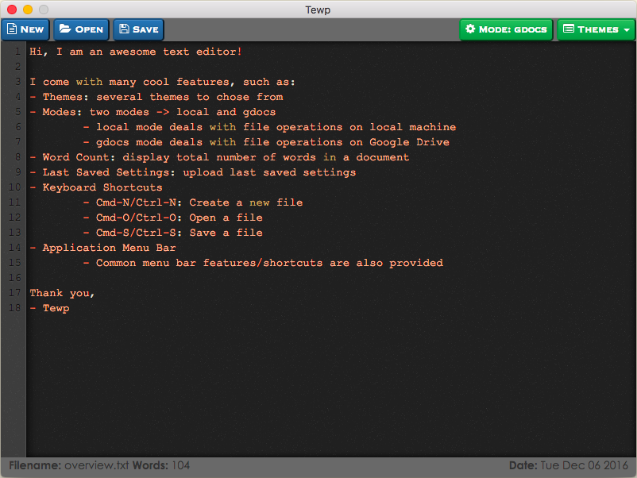

# tewp: Text Editor with Powers

`tewp`: A unique text editor with magical powers written using Electron and <http://electron.atom.io/>.



#### Features
- **Themes**
    - Provides several themes to chose from
- **Mode**
    - Provides two modes: *local* and *gdocs*
    - *local* mode deals with opening and saving files from/to local machine
    - *gdocs* mode deasl with opening and saving files from/to Google Drive (Yes, I know this is awesome!)
- **Word Count**
    - Displays total number of words in a document at the bottom of the editor
- **LSS**
    - Uploads last saved settings (LSS) which includes: last opened file, theme and mode
- **Keyboard Shortcuts**
    - TODO

Installation
------------
Read section **Create and Activate the Google Drive API** and then run these commands:

```sh
# Install dependencies
$ npm install

# Install Tewp package
$ npm run package-osx
```

Create and Activate the Google Drive API
----------------------------------------
TODO: update this section and add more

Step 1: Turn on the Drive API

- Use this wizard to create or select a project in the Google Developers Console and automatically turn on the API. Click Continue, then Go to credentials.
- On the Add credentials to your project page, click the Cancel button.
- At the top of the page, select the OAuth consent screen tab. Select an Email address, enter a Product name if not already set, and click the Save button.
- Select the Credentials tab, click the Create credentials button and select OAuth client ID.
- Select the application type Other, enter the name "Drive API Quickstart", and click the Create button.
- Click OK to dismiss the resulting dialog.
- Click the file download (Download JSON) button to the right of the client ID.
- Move this file to your working directory and rename it client_secret.json.

Source: https://developers.google.com/drive/v3/web/quickstart/nodejs

Future Improvements / New Features
----------------------------------
#### New Features
- Delete file from Google Drive

#### Future Improvements
- Fix the newline issue TODO finish this line
- Unsaved changes in a pre-existing file; a dialog to confirm cancel or save

Author
------
Deep Aggarwal  
deep.uiuc@gmail.com  
Date Started: 11/18/2016  
