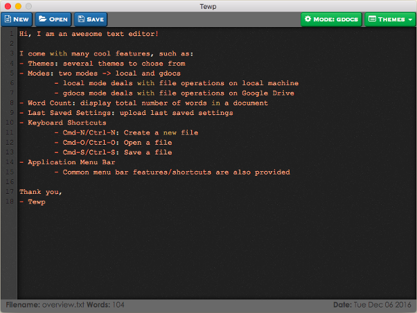

# Tewp: Text Editor with Powers

`Tewp`: A unique text editor with magical powers written using Electron and <http://electron.atom.io/>.

<p align="center">
    
</p>

### Features
- **Themes**
    - Provides several themes to chose from
- **Modes**
    - Provides two modes: *local* and *gdocs*
    - *local* mode deals with opening and saving files from/to local machine
    - *gdocs* mode deals with opening and saving files from/to Google Drive (Yes, I know this is awesome!)
- **Word Count**
    - Displays total number of words in a document at the bottom of the editor
- **Last Saved Settings**
    - Uploads last saved settings --- *last opened file, theme and mode* --- whenever you open the editor
- **Keyboard Shortcuts**
    - `Cmd+N/Ctrl+N`: Create a new file
    - `Cmd+O/Ctrl+O`: Open a file
    - `Cmd+S/Ctrl+S`: Save a file
- **Application Menu Bar**
    - Common menu bar features/shortcuts are also provided

        Task | Command
        --- | ---
        Quit | `Cmd+Q`
        Undo/Redo | `CmdOrCtrl+Z`/`Shift+CmdOrCtrl+Z`
        Cut/Copy/Paste Text | `CmdOrCtrl+X`/`CmdOrCtrl+C`/`CmdOrCtrl+V`
        Select All | `CmdOrCtrl+A`
        Toggle Developer Tools | `Alt+Command+I`
        Window | `CmdOrCtrl+M` (minimize)

Installation
------------
1. Install Node.js: <https://nodejs.org/en/>
2. Read section **Create and Activate the Google Drive API** and then run these commands:

    ```sh
    # Install dependencies
    $ npm install

    # Install Tewp (it will be installed in the /Applications directory where all your apps live)
    $ npm run package-osx
    ```

NOTE: Tewp.app is only tested on Mac OSX.

Create and Activate the Google Drive API
----------------------------------------

Follow these steps to turn on the Google Drive API and download your **client_secret.json** file:

- Use this [wizard](https://console.developers.google.com/flows/enableapi?apiid=drive) to create or select a project in the Google Developers Console and automatically turn on the API. Click **Continue**, then **Go to credentials**.
- On the **Add credentials to your project** page, click the **Cancel** button.
- At the top of the page, select the **OAuth consent screen** tab. Select an **Email address**, enter a **Product name** if not already set, and click the **Save** button.
- Select the **Credentials** tab, click the **Create credentials** button and select **OAuth client ID**.
- Select the application type **Other**, enter the name "Drive API Quickstart", and click the **Create** button.
- Click **OK** to dismiss the resulting dialog.
- Click the file download (Download JSON) button to the right of the client ID.
- Move this file inside **tewp** project (at its parent directory level) and rename it **client_secret.json**.
    -  

        ```
        $ git clone https://github.com/deep4788/tewp
        $ cd tewp
        $ mv <path-to-downloaded-json-file> client_secret.json
        ```

Source: <https://developers.google.com/drive/v3/web/quickstart/nodejs>

Future Improvements / New Features
----------------------------------
#### New Features
- Delete file from Google Drive
- A dialog to confirm (cancel or save) unsaved changes for new content on the editor
- Pressing Enter key should directly click on the Save or Open button in the modal dialog

#### Future Improvements
- Blank/new-line issue: whenever there are new lines added in a document or new lines added in an existing document and save button is clicked, the Google Drive API inserts more new lines when the file data is fetched from the drive and showed on the editor
- Some code refactoring can be done

Author
------
Deep Aggarwal  
deep.uiuc@gmail.com  
Date Started: 11/18/2016  
